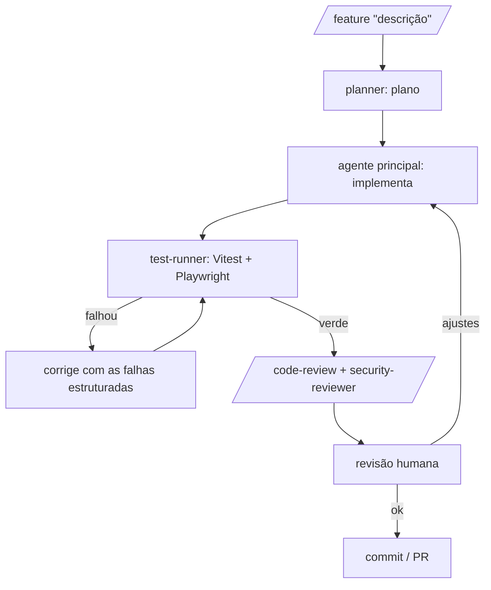

# Fluxo de desenvolvimento orquestrado por agentes de IA

Este repositório é desenvolvido com **múltiplos agentes de IA especializados por etapa**,
com um humano validando e corrigindo cada saída. Não é um recurso do produto — é o
_fluxo de trabalho_ que produz o produto.

## Os agentes e suas etapas

| Etapa | Quem executa | Responsabilidade |
| --- | --- | --- |
| **Planejamento** | subagente `planner` | Recebe a feature e devolve um plano: arquivos a tocar, passos, riscos e casos de teste. Só leitura. |
| **Codificação** | agente principal | Implementa seguindo o plano, respeitando Clean Architecture, SOLID e o estilo do time. |
| **Testes** | subagente `test-runner` | Roda Vitest e Playwright e devolve as falhas de forma estruturada para o loop de correção. É o **gate**. |
| **Revisão de código** | `/code-review` (nativo) + subagente `security-reviewer` | Correção/SOLID/reuso via revisão nativa; segredos, injection, validação de input e authz via revisão de segurança dedicada. |
| **Validação humana** | você | Aprova, corrige ou redireciona cada etapa. A IA acelera; a decisão é humana. |

## O pipeline

O ponto central é o **loop com gate de teste**: o código só avança quando os testes
passam. As falhas voltam para o agente como entrada, e ele corrige — repetindo até o verde.
Isso implementa o padrão _evaluator–optimizer_ (gerador + juiz automático).

## Como executar

- **Interativo (Claude Code):** `/feature "adicionar canal webhook"` orquestra o pipeline
  acima, delegando às etapas e parando para validação humana nos pontos de decisão.
- **Automático (headless):** `pnpm ai:feature "…"` roda o loop plan→gerar→testar→corrigir
  via Claude Agent SDK (requer `ANTHROPIC_API_KEY`; fora do CI por padrão, pois consome API).

## Padrões de orquestração aplicados

- **Orchestrator–workers** — o agente principal delega a subagentes especializados.
- **Prompt chaining** — a saída do `planner` alimenta a codificação.
- **Evaluator–optimizer** — `test-runner` e revisores atuam como juízes que realimentam o loop.
- **Human-in-the-loop** — validação humana obrigatória antes do PR.

## Qualidade automática (hooks)

Independente do fluxo acima, hooks do Claude Code mantêm o baseline de qualidade:
formatação automática ao editar arquivos e `lint`/`typecheck` antes de encerrar uma sessão.
Ver `.claude/settings.json`.
